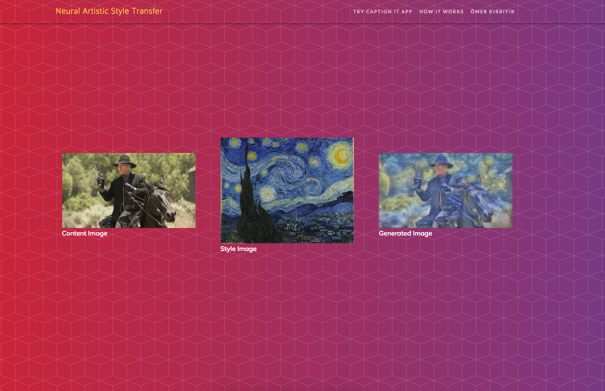

# neural_style

## Neural Artistic Style Transfer

 

This project is the implementation of the paper [_Image Style Transfer Using Convolutional Neural Networks_](https://www.cv-foundation.org/openaccess/content_cvpr_2016/papers/Gatys_Image_Style_Transfer_CVPR_2016_paper.pdf)

Please visit below to see deployed web app.

http://omerkirbiyik.com/neural-style

\
Good news! No need to download any dataset to train. We will backprop over generated image and will use pretrained CNN models.

- Make a nginx configuration to run Flask app or change static folder and use gunicorn or other serving options. This part can be tricky. [See this link for further.](https://www.digitalocean.com/community/tutorials/how-to-serve-flask-applications-with-uwsgi-and-nginx-on-ubuntu-16-04)

### References
- https://www.digitalocean.com/community/tutorials/how-to-install-nginx-on-ubuntu-16-04
- http://flask.pocoo.org/docs/1.0/deploying/
- http://cs231n.github.io/
- https://www.cv-foundation.org/openaccess/content_cvpr_2016/papers/Gatys_Image_Style_Transfer_CVPR_2016_paper.pdf
